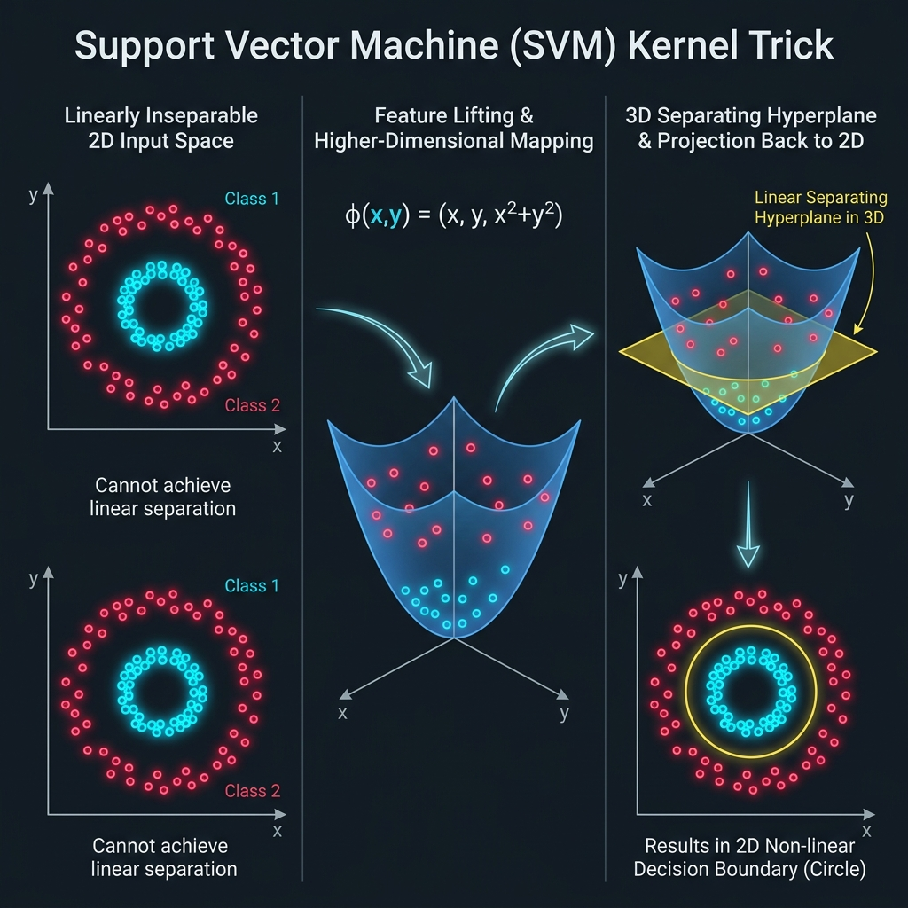
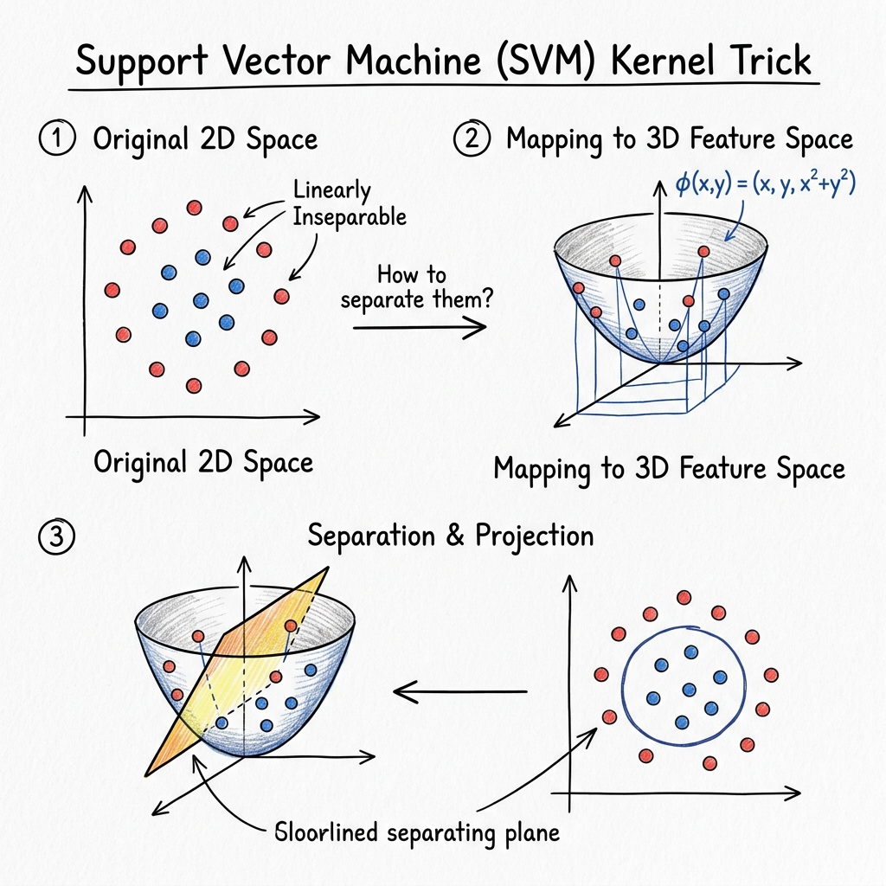
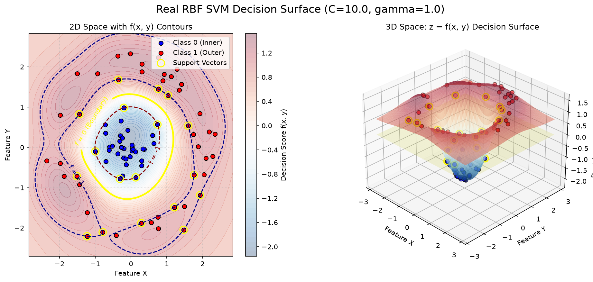

# SVM 核心技巧 (Kernel Trick) 3D 互動展示專案

線上展示 (Live Demo): [svmdemo.streamlit.app](https://svmdemo.streamlit.app)

> 本專案為教學導向，旨在向高中及機器學習初學者演示支援向量機 (SVM) 如何透過核心技巧 (Kernel Trick) 學習非線性決策邊界。



---

## 專案總覽

本專案由三個漸進式的展示組成，引導學生理解 SVM 核心技巧的概念：

| 階段 (Phase) | 檔案名稱 | 核心功能 |
| :---: | :--- | :--- |
| **1** | [`phase1_manim_kernel_trick.py`](file:///d:/Hazel/Antig/0618am/phase1_manim_kernel_trick.py) | Manim 動畫：將 2D 資料透過特徵映射 $\phi(x, y) = (x, y, x^2 + y^2)$ 投影至 3D，並展示線性分類超平面 |
| **2** | [`phase2_rbf_decision_surface.py`](file:///d:/Hazel/Antig/0618am/phase2_rbf_decision_surface.py) | 真實 sklearn RBF SVM：繪製 2D 決策邊界與 3D 決策函數曲面，並標記支持向量 (Support Vectors) |
| **3** | [`phase3_streamlit_app.py`](file:///d:/Hazel/Antig/0618am/phase3_streamlit_app.py) | 互動式 3D 模擬工作室：採用清新淺色的三欄式排版，提供步驟引導（2D 與 3D 切換）與即時模型參數（C, Gamma）調校的 Plotly 圖表與學術原理說明。 |

---

## 核心教學故事

1. **2D 空間中的同心圓資料點無法以直線分割。** 在原始 2D 空間中，沒有任何線性分類器能夠實現良好的間隔 (Margin)。
2. **透過特徵映射 (Feature Mapping)，將資料拉升至 3D 空間。** 應用映射函數 $\phi(x, y) = (x, y, x^2 + y^2)$，每個點的 Z 軸高度由其與原點的平方距離決定。
3. **在 3D 特徵空間中，可以使用一個超平面 (Hyperplane) 進行線性分割。** 內圈的藍色點保持在低處，外圈的紅色點升至高處，使一個水平平面（例如 $z = 2.0$）能夠將它們乾淨利落地切開。
4. **3D 超平面投影回 2D 空間，即形成非線性（圓形）決策邊界。** 水平平面與拋物面的交界是一個圓形，將其投影回 $z=0$ 的 2D 平面上，便形成圓形的邊界。
5. **真實的 RBF SVM 決策函數曲面展示了核心技巧在實際中的運作方式。** SVM 並非顯式地計算高維投影，而是利用徑向基底函數 (RBF) 隱式地在希爾伯特空間中計算間隔，我們將其決策分數 $f(x, y)$ 視覺化為一個平滑的 3D 連續曲面。
6. **整合式三欄工作室讓學生進行步驟式學習。** 透過左欄的「Step 1 (2D 平面)」與「Step 2 (3D 空間與 RBF 核)」切換，配合中欄的 3D 視覺化與右欄的即時原理說明，能徹底建立學生對超參數 C、Gamma 影響決策曲面幾何特徵的物理直覺。

---

## 🎨 SVM 核心概念圖 (Concept Infographics)

為了解釋低維不可分到高維線性可分的幾何轉換，本專案提供概念圖表，包含**手繪插畫教學版**與**數位科技設計版**（可於 [重點資訊與圖表指南](svm_project_infographic_report.md) 檢視完整說明）：

### 💡 手繪插畫教學版


### 💻 數位科技設計版


---

## 安裝指南

請透過 pip 安裝所需的 Python 套件：
```bash
pip install -r requirements.txt
```

> [!NOTE]
> **Windows 系統注意事項**：`manim` 依賴的 `moderngl` 與 `glcontext` 需要 **Visual C++ Build Tools** 進行編譯。如果執行 `pip install manim` 失敗：
> - 請安裝 [Microsoft C++ Build Tools](https://visualstudio.microsoft.com/visual-cpp-build-tools/) 後重試。
> - 或者使用 Conda 進行安裝：`conda install -c conda-forge manim`

---

## 執行指令說明

### Phase 1 — Manim 動畫

使用 Manim 渲染概念動畫：
```bash
# 低畫質快速預覽 (Low Quality, 480p 15fps)
python -m manim -pql phase1_manim_kernel_trick.py SVMKernelTrick3D

# 高畫質正式渲染 (High Quality, 1080p 60fps)
python -m manim -pqh phase1_manim_kernel_trick.py SVMKernelTrick3D
```

#### 沒有安裝 Manim？使用 Matplotlib 替代方案：
若您的系統未安裝 Manim 或 FFmpeg，可執行輕量級的 Matplotlib 動畫腳本：
```bash
python phase1_matplotlib_animation.py
```


---

### Phase 2 — RBF SVM 決策曲面

訓練真實的支援向量分類器 (SVC)，並同時顯示 2D 邊界與 3D 決策曲面：
```bash
python phase2_rbf_decision_surface.py
```
*生成的圖表將儲存在 `outputs/` 資料夾下。*

---

### Phase 3 — 互動式 Streamlit 3D 模擬工作室

啟動本地端三欄式淺色互動教學面板：
```bash
streamlit run phase3_streamlit_app.py
```
*或者直接訪問線上部署網址：[https://svmdemo.streamlit.app/](https://svmdemo.streamlit.app/)*

---

## 成果展示與視覺化圖表

本專案產生的所有核心視覺化圖表與動畫成果均存放於 `outputs/` 目錄中：

### 1. SVM 核心空間轉換概念圖 (Concept Infographics)
展示如何將 2D 同心圓不可分資料，透過映射 $\phi(x,y) = (x, y, x^2+y^2)$ 投影至 3D 特徵空間，並藉由超平面實現線性分割。

| 💡 手繪插畫教學版 | 💻 數位科技設計版 |
| :---: | :---: |
|  |  |

---

### 2. 真實 RBF SVM 決策邊界與 3D 曲面 (SVC Decision Surface)
Phase 2 訓練真實 RBF 核函數 SVM 後，在 2D 空間標記支持向量 (Support Vectors) 與決策間隔的 Contour，以及在 3D 空間呈現決策函數得分 $f(x, y)$ 的連續高度曲面。



---

### 3. 3D 特徵空間拉升動態圖 (Matplotlib 3D Lifting Animation)
Phase 1 輕量級 Matplotlib 動畫，展示資料點由 2D 平面動態拉升至 3D 拋物面，並被黃色平面線性切開的完整概念過程。


---

## 參數教學指南

| 參數 (Parameter) | 物理意義 / 功能 | 推薦嘗試的操作與現象 |
| :--- | :--- | :--- |
| **Kernel (核心函數)** | 控制決策邊界的幾何形狀 | 切換至 `linear`（線性核）— 觀察同心圓資料如何完全無法被直線分割（準確度降至約 50-60%）。 |
| **C (正則化參數)** | 平衡邊界間隔寬度與訓練誤差的懲罰 | 對比 `0.1`（軟邊界：較寬的間隔，容許部分錯誤以保持邊界平滑）與 `50.0`（硬邊界：較窄的間隔，極力避免任何訓練錯誤）。 |
| **Gamma (核函數寬度)** | 控制單個支持向量的影響範圍 (RBF 寬度) | 對比 `0.1`（平滑且連續的圓形邊界）與 `5.0`（過擬合：邊界在每個支持向量周圍形成尖銳突起或孤立的島嶼）。 |
| **Degree (多項式階數)** | 多項式核函數的最高次方 (僅適用於 `poly`) | 對比 `2`（二次方決策曲線）與 `5`（高階且極其扭曲的複雜幾何邊界）。 |
| **Noise (雜訊)** | 資料點的隨機高斯分佈擾動（重疊度） | 對比 `0.0`（完美分開且界線分明的同心圓）與 `0.3`（高度重疊、邊界模糊的混亂分佈）。 |

---

## 重要數學注意事項

在 Phase 1 中所使用的映射 $z = x^2 + y^2$，僅作為直覺式的教學展示，用來解釋為什麼非線性資料投影到高維度後會變得線性可分。真實的 RBF 核函數並非只將資料映射到 3D 空間，它實際上對應一個高維度甚至無窮維度的希爾伯特空間 (Hilbert Space)。Phase 2 與 Phase 3 中所展示的 3D 決策曲面，呈現的是決策函數值 $f(x, y)$ 的得分分佈，而非高維特徵空間本身的直接坐標。

---

## 課堂教學建議

* **線性限制 (Linear Limitations)**：在 Phase 3 控制面板中先將核心函數設為 `linear`。讓學生親自觀察一條直線無法有效分割環狀資料，藉此引導出非線性核心技巧的必要性。
* **Gamma 的「高峰」效應**：選擇 `rbf` 核函數，並將 Gamma 調高至 `10.0`。引導學生觀察 3D Plotly 決策曲面在個別支持向量周圍產生的尖銳突起，解釋這就是過擬合 (Overfitting) 以及泛化能力變差的原因。
* **C 值的軟硬彈性**：調整 $C$ 為 `0.1` 和 `50.0`。展示 2D 空間中邊界間隔（虛線）隨 $C$ 增加而變窄的現象，並解釋當 $C$ 很小時，模型是如何容許點越過間隔以換取更平滑簡單的邊界。

---

## 目錄結構說明

```text
.
├── README.md                           # 專案說明文件 (中文版)
├── requirements.txt                    # Python 套件依賴清單
├── .gitignore                          # Git 排除設定檔
├── phase1_manim_kernel_trick.py        # Phase 1: Manim 3D 概念動畫
├── phase1_matplotlib_animation.py      # Phase 1 替代方案: Matplotlib 3D 動畫
├── phase2_rbf_decision_surface.py      # Phase 2: Matplotlib SVM 實體決策曲面繪製
├── phase3_streamlit_app.py              # Phase 3: Streamlit + Plotly 互動式網頁應用程式
├── utils/                              # 共用輔助模組資料夾
│   ├── data_generator.py               # 環狀資料集生成器
│   └── svm_utils.py                    # SVM 訓練與網格計算輔助程式
├── assets/                             # 靜態資源資料夾 (如專案架構藍圖等)
└── outputs/                            # 程式生成的圖表與動畫暫存區 (Git 已忽略)
```
