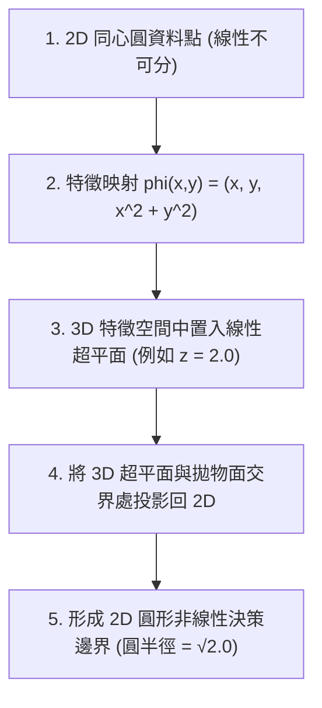
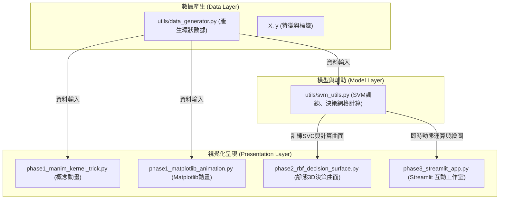

# SVM 核心技巧 (Kernel Trick) 專案重點資訊與圖表指南

本文件整理了「SVM 核心技巧 3D 互動展示專案」的關鍵教學概念、系統架構以及參數調整邏輯，並結合視覺化圖表與概念示意圖，方便快速理解本專案的精髓。

---

## 💡 核心教學故事 (Core Pedagogical Story)

核心技巧（Kernel Trick）的教學旨在引導學習者建立從 **低維不可分** 到 **高維線性可分** 的幾何直覺。



1. **2D 空間的侷限性**：同心圓分布的資料（內圈藍點、外圈紅點），在 2D 平面上無法被任何直線分割。
2. **高維特徵投影**：利用 $\phi(x, y) = (x, y, x^2 + y^2)$ 將資料拉升至 3D 空間，每個點的 Z 軸高度即為該點到原點距離的平方。
3. **高維線性分割**：在 3D 空間中，藍色點留在低處，紅色點升至高處，此時可藉由一個水平超平面（例如 $z = 2.0$）完美分割兩類。
4. **回歸低維邊界**：該水平面與 3D 拋物面的交線為一個圓，投影回 2D 平面後，即成為完美的圓形非線性邊界。

---

## 🛠️ 專案三階段架構 (Three-Phase Architecture)

本專案採用漸進式的開發與學習路徑，包含概念動畫、實體模型繪製與互動式 Web App：

| 階段 (Phase) | 核心工具與模組 | 產出與呈現方式 | 物理與數學意義 |
| :---: | :--- | :--- | :--- |
| **Phase 1**<br>概念動畫 | `Manim` / `Matplotlib` | [phase1_manim_kernel_trick.py](file:///d:/Hazel/Antig/0618am/phase1_manim_kernel_trick.py)<br>[phase1_matplotlib_animation.py](file:///d:/Hazel/Antig/0618am/phase1_matplotlib_animation.py) | **直觀幾何展示**：<br>展示點從 2D 平面被「拉升」至 3D 拋物面，並以黃色超平面切開的動態過程。 |
| **Phase 2**<br>實體決策面 | `scikit-learn` (SVC)<br>`Matplotlib` | [phase2_rbf_decision_surface.py](file:///d:/Hazel/Antig/0618am/phase2_rbf_decision_surface.py)<br>輸出為 [outputs/rbf_decision_surface.png](file:///d:/Hazel/Antig/0618am/outputs/rbf_decision_surface.png) | **真實模型訓練**：<br>訓練真實的 RBF SVM，將決策函數 $f(x, y)$ 繪製為連續的 3D 決策曲面，並標記支持向量 (Support Vectors)。 |
| **Phase 3**<br>互動工作室 | `Streamlit`<br>`Plotly` | [phase3_streamlit_app.py](file:///d:/Hazel/Antig/0618am/phase3_streamlit_app.py)<br>線上展示：[svmdemo.streamlit.app](https://svmdemo.streamlit.app) | **即時參數調校**：<br>三欄式響應介面（參數與步驟控制、Plotly 互動式 3D 圖、學術原理解析），方便學生即時觀察 C 與 Gamma 的影響。 |

---

## 🎛️ 關鍵超參數與物理直覺 (Hyperparameters Intuition)

調整 SVM 參數會直接影響決策邊界的幾何形狀與模型泛化能力：

> [!TIP]
> **超參數調節的實踐建議**：
> - **C 越大**：對錯誤容忍度越低，邊界越窄、越扭曲（趨於過擬合）。
> - **Gamma 越大**：支持向量的影響範圍越小，決策曲面在支持向量周圍會產生尖銳的「高峰」或「孤島」結構（嚴重過擬合）。

```
                                    C (正則化係數)
                 軟邊界 (C 較小)  ◀──────────────────▶  硬邊界 (C 較大)
                 - 邊界較平滑                         - 邊界較扭曲、窄
                 - 容許部分訓練錯誤                     - 極力避免任何錯誤

                                  Gamma (核函數寬度)
                 廣域影響 (G 較小) ◀──────────────────▶ 局域影響 (G 較大)
                 - RBF 影響範圍大                     - RBF 影響範圍小
                 - 決策面平滑連續                     - 出現孤立「尖峰」或「島嶼」
```

---

## 🗺️ 專案目錄結構與資料流 (Data Flow & Project Structure)



---

## 🎨 SVM 核心技巧概念圖 (Concept Infographic)

以下提供兩種風格的 SVM 核心技巧概念圖（數位科技版與手繪插畫版），展示了從 2D 到 3D 映射、超平面切分再投影回 2D 的完整演進邏輯：

````carousel

<!-- slide -->

````

> [!NOTE]
> 本圖表由 `generate_image` 工具生成，並已儲存於本 conversation 的 artifacts 資料夾中。您可以透過滑動切換不同的視覺風格。

